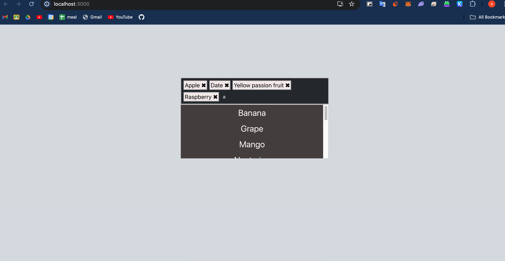
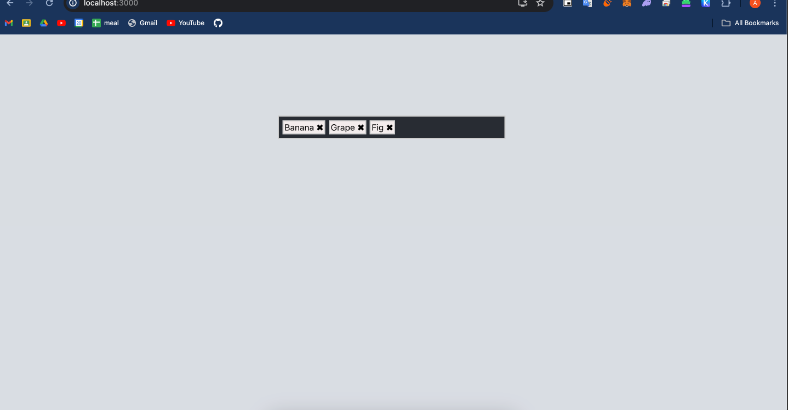

# TagInput

TagInput is a React component designed to enhance user experience by allowing users to add and remove tags dynamically. It's perfect for fields that require tag or keyword input, such as in forms for entering interests, skills, categories, etc. This component includes an autocomplete feature that suggests items based on the input, making it easier for users to find and select tags.


## Features

- **Dynamic Tagging**: Add or remove tags with ease.
- **Autocomplete Suggestions**: Get real-time suggestions as you type.
- **Fully Customizable**: Style it according to your needs.
- **Responsive**: Works well on both desktop and mobile devices.


### Installation and Running Instructions

#### Prerequisites
Make sure you have the following installed on your system:
- [Node.js](https://nodejs.org/) (which includes npm)

#### Step 1: Clone the Repository

```bash
git clone https://github.com/yourusername/TagInput.git
cd TagInput
```

#### Step 2: Install Dependencies

```bash
npm install
```

#### Step 3: Start the Development Server

```bash
npm start
```

#### Step 4: Using the Component
With the development server running, you can now see the `TagInput` component in action. To integrate it into a different part of your project, import and use it as shown in the sample usage:

```jsx
import React from 'react';
import TagInput from './path/to/TagInput'; // Adjust the import path as necessary

function App() {
  return (
    <TagInput />
  );
}

export default App;
```

